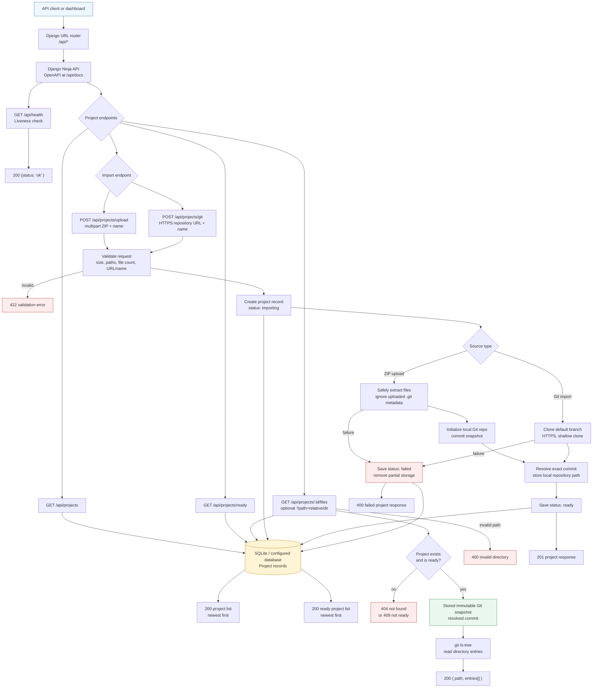
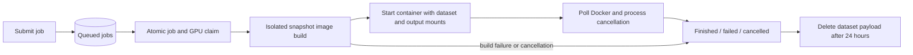

# Training Server API Architecture

This document describes the backend flow currently implemented in the project.
The API is a Django application using Django Ninja. It currently manages
immutable project snapshots and exposes their directory trees; training-job
submission and container execution are still future work.

## Big-picture API flow

## Endpoint inventory

| Endpoint | Purpose | Main responses |
| --- | --- | --- |
| `GET /api/health` | Application liveness only; it does not check Docker or GPU availability. | `200` |
| `GET /api/projects` | List all imported projects, including failed and ready records. | `200` |
| `GET /api/projects/ready` | List projects whose snapshots are ready to browse or use. | `200` |
| `GET /api/projects/{project_id}/files` | List the root directory of a ready snapshot. | `200`, `404`, `409` |
| `GET /api/projects/{project_id}/files?path=src` | List a relative directory within a ready snapshot. | `200`, `400`, `404`, `409` |
| `POST /api/projects/upload` | Import a ZIP archive as a new immutable Git-backed snapshot. | `201`, `400`, `422` |
| `POST /api/projects/git` | Import the default branch of an HTTPS Git repository. | `201`, `400`, `422` |
| `GET /api/docs` | Django Ninja's generated interactive API documentation. | `200` |

## Request and storage flow

Both import endpoints run synchronously in the web request:

1. Validate the project name and source-specific input.
2. Create a `Project` database record in `importing` state.
3. Materialize the source under `PROJECT_STORAGE_ROOT/<project-id>/`.
4. Represent the source as a local Git repository and resolve an exact commit.
5. Store the repository path and commit, then mark the project `ready`.

ZIP imports reject unsafe paths, symbolic links, excessive file counts, and
size-limit violations. Uploaded `.git` metadata is discarded. Git imports only
accept HTTPS URLs without embedded credentials and clone the default branch.

If materialization fails, partial storage is removed and the project record is
retained with status `failed` and an error message. Invalid request data returns
`422`; import failures return `400` with the failed project representation.

## File browsing behavior

File browsing reads the stored commit with `git ls-tree`; it does not expose the
server's storage path. Only relative directory paths are accepted. Parent
traversal, absolute paths, backslashes, null bytes, missing directories, and
file paths are rejected. Symlinks and submodules are reported as entries but
are not followed or expanded.

## Training worker

Training submission persists a queued `TrainingJob` with the selected script,
arguments, saved Dockerfile, and optional per-job dataset. It performs no Docker
work in the HTTP request. `training_worker` polls the database, reserves one GPU
per active execution, builds the image, starts its container, and tracks the
terminal state. Its periodic dataset sweep replaces the maintenance timer.

Active executions are GPU reservations. Partial unique constraints prohibit two
active attempts for a job or canonical GPU UUID. The single-host worker and
manual commands share filesystem operation locks; SQL transactions cover only
state changes. Builders inherit a separate lock, write a durable result, and
never start containers. Restart recovery consumes completed builds, waits for
living builders, restarts interrupted builds up to three times, and reconciles
existing containers by saved identity. A Docker outage retains the reservation.

`retry_training_job` requeues terminal work before dataset expiry;
`cancel_training_job` records cancellation and stops or signals the relevant
execution. `run_training_job --image` and `maintain_training` remain manual
troubleshooting commands. The standalone CLI does not participate in this queue.

Authentication, authorization, multi-host scheduling, asynchronous project
imports, and remote blob storage remain outside the current API surface.
